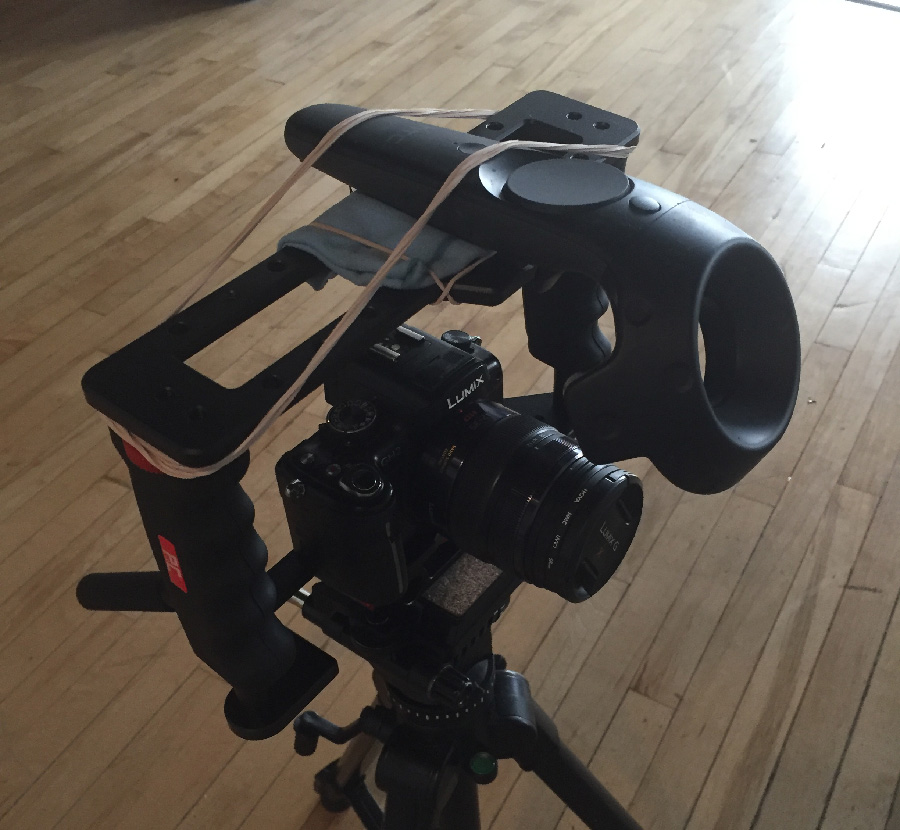
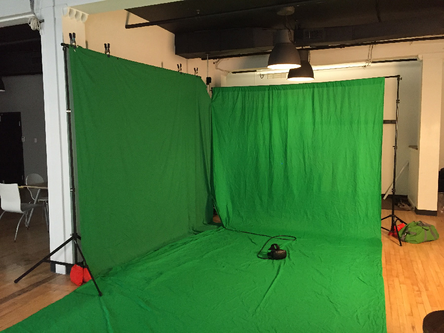
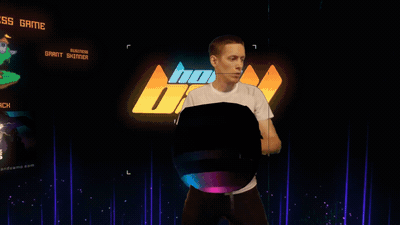



Use your wits and your paddles to win against a rogue AI in order to win your freedom in this 80s inspired neon soaked VR raquetball game.

### Credits  
_Editing/Direction_ - Marlon Wiebe  
_Art/Game_ - [Treefortress Games](http://treefortress.com)  
_Music by_ - [Dance of the Dead][0b32b55b]  
_Actor_ - [Mack Vargas](http://mackvargas.com)

### Making Of Preamble  

I'm not going to go in-depth into the details of how to make mixed-reality trailers, there are a ton of blog posts already about that.  Check out [this one by Kert Gartner](http://www.kertgartner.com/making-mixed-reality-vr-trailers-and-videos/), this one [by Colin Northway](http://northwaygames.com/how-to-mixed-reality/), and [this Steam Community thread](https://steamcommunity.com/app/358720/discussions/0/405694031549662100/) about mixed reality.

Ok, on to the post.

### Making Of

Making the Holoball trailer was new territory for me as it was my first mixed reality trailer.  I knew that I didn't have the budget or pool of talent that Kert Gartner used on some of his amazing mixed reality trailers, but since Valve has baked in mixed reality into their SteamVR plugin, I knew that I could make it look pretty good with the limited resources that I had.

#### Camera Offset Woes

Still, it took a ton of communication with Shawn from TreeFortress and custom code and fine tuning in order to get it right.  For example, you must tell the game you're working with how far the controller is offset to the camera so that they'll be matched when you edit them together.

{: .col-12 }
_This was the rig I used for the shoot._{: .image-comment }

[Valve's mixed reality solution](https://steamcommunity.com/app/358720/discussions/0/405694031549662100/) has is a script that you have to edit and type in the offset manually and reboot the game each time.  This was a HUGE pain in the ass and it would take hours just to try and match the in-game camera with the real camera.  

Shawn came up with a nice solution to this, and added a small script to his game that would detect changes to Valve's script in real time, so I could at least make changes and see if things matched in real-time.  You can check out how he implemented this [on this forum post](https://steamcommunity.com/app/358720/discussions/0/405694031549662100/?ctp=13#c352792037311375886).

The one pro to Valve's solution is that once you figure out the offsets for the rig in that file, as long as you don't move the controller in relation to the camera or use a different lens, you never have to change it again.

{: .col-12 }
_This was my green screen set up for the shoot.  Not ideal, but thanks to keying software being so good, it did the trick!_{: .image-comment }

#### The PSVR Conundrum

Another aspect of this trailer that took time to resolve is the fact that HoloBall was being released on the [Sony Playstation VR headset](https://www.playstation.com/en-ca/explore/playstation-vr/).  Since I only owned a Vive and getting a PSVR set would be tough, we tried a couple techniques in order to mask the Vive in the mixed reality shots.  Eventually, Shawn came up with a solution that would place a stylized motorcycle helmet in the mixed reality shots that completely masked the Vive and I took great care in post-production to make sure that the Vive doesn't appear.

{: .col-12 }
_My first test with the helmet._{: .image-comment }

In the end however, Sony has a brand to protect and they wanted to show their headset, so we ended up making another version of the trailer with an in-game avatar.

{: .col-12 }
_IK Avatar._{: .image-comment }

#### Conculsion

Overall, it was a huge learning curve and I'm pleased with the results, but making mixed reality this way is a very challenging way to make a trailer due to the amount of equipment and resources you need in order to make it look good, and even after you've shot the footage, it often doesn't line up properly or something glitched out but you don't know until you've brought it all into After Effects and put it together.

However, people like Owlchemy Labs is [making some very interesting tools](http://owlchemylabs.com/owlchemyvr-mixed-reality-update-2/) for mixed reality that will hopefully simplify the process further.  Looking forward to seeing what comes of that!

  [0b32b55b]: https://dancewiththedead.bandcamp.com/ "Dance with the Dead Bandcamp"
